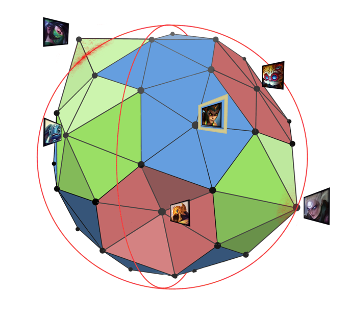

# GlobeVision

Improve your League Gaming Skills with Globe Vision. In this Mixed Reality HoloLens Application you can directly see current winrates of champions visualized relatively to one another.

Concept:

A mixed reality sphere with data points, the position of the points, can then be interpreted for different things.
One might be the win-rate of the champions, ban-rate or popularity.
The Hypothesis is that this fully visual way of exploring the data can give you new insights.

